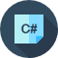

### **Hi there, i'm [Vugar Kerimov](https://vugarkerimov.ru). 👋**

<!-- Top facts about me -->
- 📚 I'm student, programmer, designer and musician. 
- 🔍 I'm constantly looking for new opportunities for self-realization, development of my soft and hard skills.
- 🚀 I try to make all my projects and ideas come true.
- 🌠 I'm looking for like-minded people for rapid development in media, IT, design, and entrepreneurship.
- ⚡ Fun fact: kids ask 300 questions a day. Don't kill a child inside you!

-- codewars: [link][https://www.codewars.com/users/amongloneliness]

<!-- Icons of languages and programs -->
### Languages and skills:

